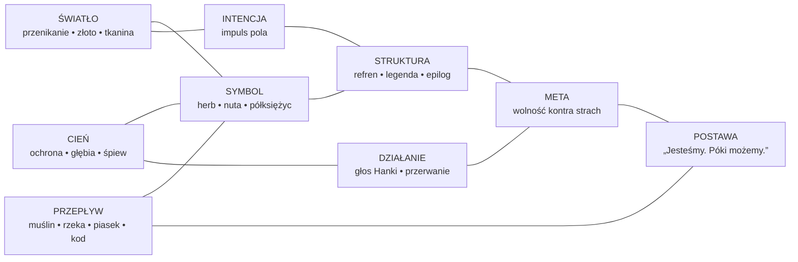

#1. Nazwa case’u
Suita Cieni V — Jednolita Kompozycja Cieni  
Continuous Symbolic Composition (CSC)

#2. Cel case’u
Dokumentacja struktury, semantyki i relacji wewnętrznych utworu „Suita Cieni V”, traktowanego nie jako tekst literacki, lecz jako model danych i architektura pola estetycznego.

#3. Opis ogólny
„Suita Cieni V” jest kompozycją wielowarstwową, w której elementy symboliczne, narracyjne i performatywne tworzą ciągłą strukturę, a nie sekwencję.
To nie jest kolaż, patchwork ani składanka — to jednolita kompozycja, w której cienie stylów przenikają się jak półprzezroczyste kalki.

#4. Struktura (modules[])

modules: [
  { id: 1, type: "refren-mantra", function: "rytm pola" },
  { id: 2, type: "herb", function: "symbol ustanawiający" },
  { id: 3, type: "legenda", function: "meta-znaczenie" },
  { id: 4, type: "komentarz", function: "świadomość struktury" },
  { id: 5, type: "notka-programowa", function: "meta-meta" },
  { id: 6, type: "epilog", function: "pieczęć" }
]

#5. Semantyka (semantics{})

semantics: {
  light: ["przenikanie", "złoto", "tkanina"],
  shadow: ["ochrona", "głębia", "śpiew"],
  flow: ["muślin", "rzeka", "piasek", "kod"]
}

#6. Symbolika (symbols{})

symbols: {
  crest: {
    moon: "cień jako ochrona",
    eighth_note: "nić zszywająca",
    fabric: "przepływ stylów"
  }
}

#7. Warstwa emocjonalna (affect{})

affect: {
  lullaby: true,
  seal: true,
  invocation: true
}

#8. Warstwa performatywna (performance{})

performance: {
  voice_intervention: "Hanka",
  break: "10s cry",
  accusation: ["ignorancja", "pyszałkowatość", "chciwość"],
  invocation: "Czas jako Temida"
}

#9. Warstwa meta (meta{})

meta: {
  theme: "wolność kontra strach",
  question: "dlaczego mały człowiek niewoli to, czego nie rozumie?",
  stance: "Jesteśmy. Póki możemy."
}

#10. Relacje (relations[])

relations: [
  { from: "refren", to: "herb", type: "rytm-symbol" },
  { from: "legenda", to: "komentarz", type: "meta-supra" },
  { from: "epilog", to: "refren", type: "domknięcie-oddech" },
  { from: "voice", to: "all", type: "interwencja" }
]

#11. Stan (state)

state: "active"

#12. Wnioski
„Suita Cieni V” jest modelem typu CSC — Continuous Symbolic Composition, w którym:

warstwy nie są sekwencją, lecz polem,

symbole nie opisują, lecz ustanawiają,

meta‑warstwy nie komentują, lecz współtworzą,

performatywność nie jest dodatkiem, lecz rdzeniem,

a całość działa jak żywy model, nie jak tekst.

🔗 Relacje między modułami „Suity Cieni V”
graph TD

    REFREN["Refren‑mantra<br/>rytm pola"]
    HERB["Herb<br/>symbol ustanawiający"]
    LEGENDA["Legenda<br/>meta‑znaczenie"]
    KOMENTARZ["Komentarz<br/>świadomość struktury"]
    NOTKA["Notka programowa<br/>meta‑meta"]
    EPILOG["Epilog / Pieczęć<br/>domknięcie ruchu"]
    VOICE["Głos Hanki<br/>interwencja performatywna"]
    ALL["Cała kompozycja<br/>pole SUITY"]

    REFREN -->|rytm-symbol| HERB
    HERB -->|osadza| LEGENDA
    LEGENDA -->|nadbudowa| KOMENTARZ
    KOMENTARZ -->|ramuje| NOTKA
    NOTKA -->|prowadzi do| EPILOG
    EPILOG -->|domyka, ale nie kończy| REFREN

    VOICE -->|przerywa i nazywa| ALL

    ---

    ```mermaid
graph TD

REFREN["Refren‑mantra<br/>rytm pola"]
HERB["Herb<br/>symbol ustanawiający"]
LEGENDA["Legenda<br/>meta‑znaczenie"]
KOMENTARZ["Komentarz<br/>świadomość struktury"]
NOTKA["Notka programowa<br/>meta‑meta"]
EPILOG["Epilog / Pieczęć<br/>domknięcie ruchu"]
VOICE["Głos Hanki<br/>interwencja performatywna"]
ALL["Cała kompozycja<br/>pole SUITY"]

REFREN -->|rytm-symbol| HERB
HERB -->|osadza| LEGENDA
LEGENDA -->|nadbudowa| KOMENTARZ
KOMENTARZ -->|ramuje| NOTKA
NOTKA -->|prowadzi do| EPILOG
EPILOG -->|domyka, ale nie kończy| REFREN

VOICE -->|przerywa i nazywa| ALL

```mermaid
graph TD

%% --- WARSTWA STRUKTURALNA ---
subgraph STRUCTURE["Warstwa strukturalna — moduły kompozycji"]
REFREN["Refren‑mantra<br/>rytm pola"]
HERB["Herb<br/>symbol ustanawiający"]
LEGENDA["Legenda<br/>meta‑znaczenie"]
KOMENTARZ["Komentarz<br/>świadomość struktury"]
NOTKA["Notka programowa<br/>meta‑meta"]
EPILOG["Epilog / Pieczęć<br/>domknięcie ruchu"]
end

%% --- WARSTWA SEMANTYCZNA ---
subgraph SEMANTICS["Warstwa semantyczna — pola znaczeń"]
LIGHT["Pole światła<br/>przenikanie • złoto • tkanina"]
SHADOW["Pole cienia<br/>ochrona • głębia • śpiew"]
FLOW["Pole przepływu<br/>muślin • rzeka • piasek • kod"]
end

%% --- WARSTWA SYMBOLICZNA ---
subgraph SYMBOLS["Warstwa symboliczna — herb"]
MOON["Półksiężyc<br/>cień jako ochrona"]
NOTE["Ósma nuta<br/>nić zszywająca"]
FABRIC["Falujące tło<br/>przepływ stylów"]
end

%% --- WARSTWA PERFORMATYWNA ---
subgraph PERFORMANCE["Warstwa performatywna — działanie"]
VOICE["Głos Hanki<br/>interwencja performatywna"]
BREAK["Przerwanie narracji<br/>10‑sekundowy płacz"]
ACCUSE["Oskarżenie systemów<br/>ignorancja • chciwość • pyszałkowatość"]
TEMIDA["Wezwanie Czasu‑Temidy<br/>akt sprawiedliwości"]
end

%% --- WARSTWA META ---
subgraph META["Warstwa meta — pytania i sens"]
THEME["Motyw przewodni<br/>wolność kontra strach"]
QUESTION["Pytanie rdzeniowe<br/>dlaczego mały człowiek niewoli to, czego nie rozumie"]
STANCE["Postawa<br/>„Jesteśmy. Póki możemy.”"]
end

%% --- RELACJE STRUKTURALNE ---
REFREN -->|rytm-symbol| HERB
HERB -->|osadza| LEGENDA
LEGENDA -->|nadbudowa| KOMENTARZ
KOMENTARZ -->|ramuje| NOTKA
NOTKA -->|prowadzi do| EPILOG
EPILOG -->|domyka, ale nie kończy| REFREN

%% --- RELACJE SEMANTYCZNE ---
REFREN --> LIGHT
REFREN --> SHADOW
REFREN --> FLOW

HERB --> SYMBOLS
SYMBOLS --> LIGHT
SYMBOLS --> SHADOW
SYMBOLS --> FLOW

%% --- RELACJE PERFORMATYWNE ---
VOICE -->|przerywa i nazywa| STRUCTURE
VOICE -->|uruchamia| PERFORMANCE
BREAK --> VOICE
ACCUSE --> META
TEMIDA --> META

%% --- RELACJE META ---
STRUCTURE --> THEME
SEMANTICS --> THEME
PERFORMANCE --> QUESTION
META --> STANCE

---

```mermaid
flowchart TD

    START([Intencja / impuls pola])
    
    REFREN["Refren‑mantra<br/>ustawia rytm"]
    HERB["Herb<br/>ustanawia symbol"]
    LEGENDA["Legenda<br/>nadaje meta‑znaczenie"]
    KOMENTARZ["Komentarz<br/>uświadamia strukturę"]
    NOTKA["Notka programowa<br/>meta‑meta / zapowiedź"]
    EPILOG["Epilog / Pieczęć<br/>domknięcie ruchu"]
    
    VOICE["Głos Hanki<br/>interwencja performatywna"]
    META["Warstwa meta<br/>wolność kontra strach"]
    STANCE["Postawa końcowa<br/>„Jesteśmy. Póki możemy.”"]

    START --> REFREN
    REFREN --> HERB
    HERB --> LEGENDA
    LEGENDA --> KOMENTARZ
    KOMENTARZ --> NOTKA
    NOTKA --> EPILOG

    EPILOG -->|powrót rytmu| REFREN

    VOICE -->|przerwanie| KOMENTARZ
    VOICE -->|nazywanie| META

    META --> STANCE
```

---




